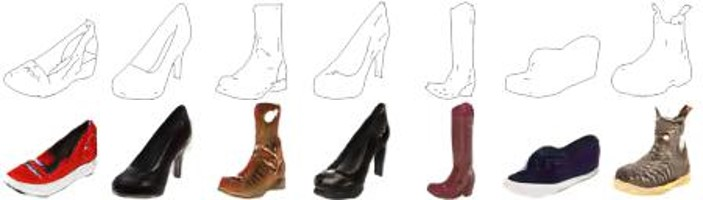
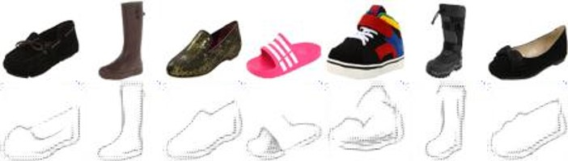
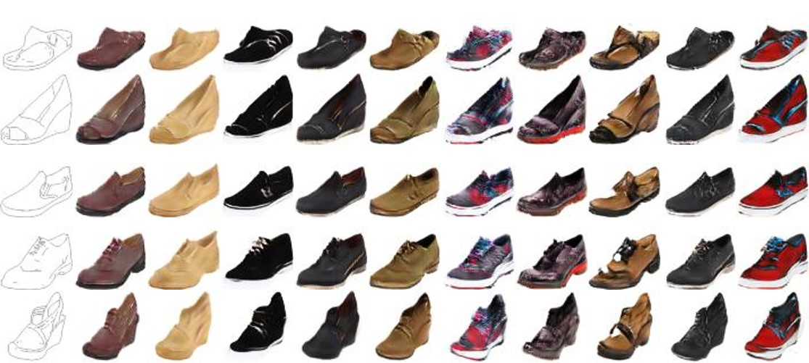

# Augmented Cycle GAN
A Theano re-implementation of Augmented CycleGAN

## Requirements

[Theano](http://deeplearning.net/software/theano/)

[Neuralnet](https://github.com/justanhduc/neuralnet)

## Usage

```
python train.py
```

Use ```--help``` for more options.

To test a pretrained network
```
python train.py --test --param_file_version a-saved-weight-file-version
```

## Results

Sketches to shoes
<p align='center'>
   
</p>

Shoes to sketches
<p align='center'>
   
</p>

Sketches to multiple shoes
<p align='center'>
   
</p>

## References

If you use the implementation, you must cite the following paper

```
@article{almahairi2018augmented,
  title={Augmented CycleGAN: Learning Many-to-Many Mappings from Unpaired Data},
  author={Almahairi, Amjad and Rajeswar, Sai and Sordoni, Alessandro and Bachman, Philip and Courville, Aaron},
  journal={arXiv preprint arXiv:1802.10151},
  year={2018}
}
```

[Official implementation](https://github.com/aalmah/augmented_cyclegan).
